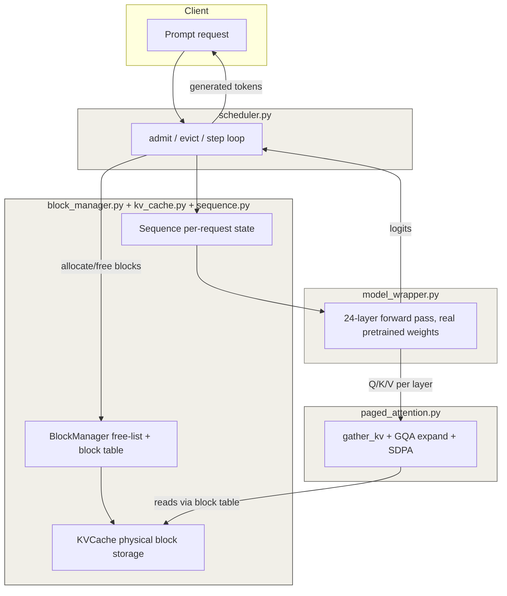

# pico-vllm

A from-scratch, single-GPU inference engine implementing PagedAttention-style
KV-cache management and continuous batching, verified against real
`Qwen2.5-0.5B-Instruct` outputs and benchmarked against a naive static
batching baseline.

Every core component — block allocation, the KV-cache, GQA-aware paged
attention, and the full multi-layer forward pass — is checked directly
against Hugging Face's own model outputs (`torch.allclose`), not just
assumed correct. The scheduler's benefit is backed by measured numbers,
not claims.

---

## Benchmark results

### 1. Naive batching vs. continuous batching (eviction efficiency)

Four prompts run together, three capped at 5 tokens and one at 50 —
deliberately mismatched lengths, since matched lengths would hide the
difference naive batching has.

| Metric                        | Naive | Continuous     |
|--------------------------------|-------|-----------------|
| Total wall-clock time (s)     | 26.31 | 9.38            |
| Real tokens generated          | 65    | 65              |
| Wasted forward-pass steps     | 135   | 0 (by design)   |
| Throughput (real tokens/sec)  | 2.47  | 6.93            |

**135 wasted forward passes** under naive batching — more wasted
computation than real computation (65 real tokens) — purely because
finished sequences keep getting stepped until the *entire* batch
finishes. Continuous batching evicts a sequence and frees its blocks the
moment it's done, giving a **2.8x throughput improvement** on identical
input, identical hardware, identical model.

### 2. Admission under memory pressure

Four requests, but the block pool only ever holds 3 blocks — not enough
for all four to start at once.

```
Admission timeline (step, seq_id):
  step   0: seq_2 admitted
  step   0: seq_0 admitted
  step   0: seq_1 admitted
  step   8: seq_3 admitted

All 4 requests completed in 4.50s, despite only 3 blocks ever being
available at once.
```

`seq_3` sat in the scheduler's waiting queue for 8 steps and was only
admitted once an earlier sequence finished and freed its block. Naive
batching has no concept of a waiting queue at all — it would fail
outright trying to allocate blocks for every sequence up front. This is
the other half of continuous batching's value: not just avoiding wasted
compute, but keeping the system moving under memory pressure that would
otherwise stall it entirely.

---

## Architecture



A request enters the scheduler, which allocates an initial block via
`BlockManager` and creates a `Sequence` to track its state. Each
generation step runs the full 24-layer forward pass through
`model_wrapper.py`, which calls `paged_attention.py` per layer —
gathering that sequence's real (non-padded) key/value data from
`KVCache` across its allocated blocks, expanding for GQA, and running
attention. The scheduler re-evaluates admission and eviction before
every single step, not just once per batch — this is what continuous
batching actually means.

A minimal FastAPI layer (`api.py`) wraps this for HTTP access.

---

## What's verified, and how

Every layer of this system is checked against real Hugging Face model
output, not just assumed correct from the math:

- **`KVCache` write/read** — verified against `past_key_values` from a
  real forward pass, including correctly sizing for this model's GQA
  setup (14 query heads, 2 KV heads) and matching its native bfloat16
  dtype.
- **`Sequence`** — unit tested in isolation: block-boundary crossing,
  the allocation-failure path, and that written data is retrievable.
- **`paged_attention`** — verified against real HF attention output
  using forward hooks on `q_proj`/`o_proj`, across a sequence long
  enough to force a multi-block gather. Caught and fixed a real bug in
  the process: the captured query was pre-RoPE while HF's cached keys
  are post-RoPE, causing a small but real mismatch — fixed by applying
  the same rotary embedding to the query before comparison.
- **Full multi-layer generation (`model_wrapper.py`)** — compared
  per-step logits against HF's own forward pass at identical input
  prefixes. In bfloat16, logits showed small, consistent numerical
  drift (~0.17-0.2 max abs diff) rather than growing/compounding error —
  diagnosed as floating-point precision, not a logic bug, and confirmed
  by rerunning in float32, where logits matched within tight tolerance.
- **Naive batching correctness** — confirmed that running multiple
  sequences sharing one `KVCache`/`BlockManager` produces byte-identical
  output to running each sequence completely alone, ruling out
  cross-sequence data corruption.

---

## Known limitations

- **No preemption.** If a *running* sequence needs a new block and the
  pool is fully exhausted (not just "this sequence needs one," but none
  exist anywhere), the current scheduler raises rather than evicting
  another running sequence or waiting gracefully. A real system would
  need a preemption policy here.
- **The server isn't truly concurrent yet.** `api.py` spins up a fresh
  `Scheduler` per HTTP request rather than running one shared scheduler
  loop that batches concurrent HTTP requests together. True concurrent
  continuous batching would need a background loop stepping one shared
  scheduler, with request handlers awaiting their own completion.
- **Attention uses gather + `scaled_dot_product_attention`, not a fused
  kernel.** Blocks are gathered into a contiguous tensor before
  attention rather than reading directly from scattered blocks inside a
  custom kernel (e.g. Triton). This was a deliberate scope decision —
  the memory management and scheduling logic were the focus, not kernel
  engineering — noted here rather than left implicit.
- **Single GPU/CPU, single model.** No tensor parallelism, no
  multi-model serving.

---

## Repo layout

```
pico-vllm/
├── config/                  # Config dataclass + config.yaml (real Qwen2.5-0.5B-Instruct architecture values)
├── block_manager.py         # Free-list + per-sequence block table
├── kv_cache.py               # Real KV-cache tensors, block-indexed read/write
├── sequence.py                # Per-sequence state: block list, token count, append_token
├── paged_attention.py        # gather_kv + GQA expansion + scaled_dot_product_attention
├── model_wrapper.py          # Full 24-layer forward pass using paged_attention
├── naive_batching.py          # Naive static batching baseline
├── scheduler.py                # Iteration-level continuous batching (admit/evict)
├── api.py                      # Minimal FastAPI server
├── run_naive_vs_continuous.py       # Benchmark 1: eviction efficiency
├── run_admission_under_pressure.py  # Benchmark 2: admission under memory pressure
├── tests/                      # pytest suite — correctness checks for every component above
└── doc/progress.md              # Day-by-day build log
```