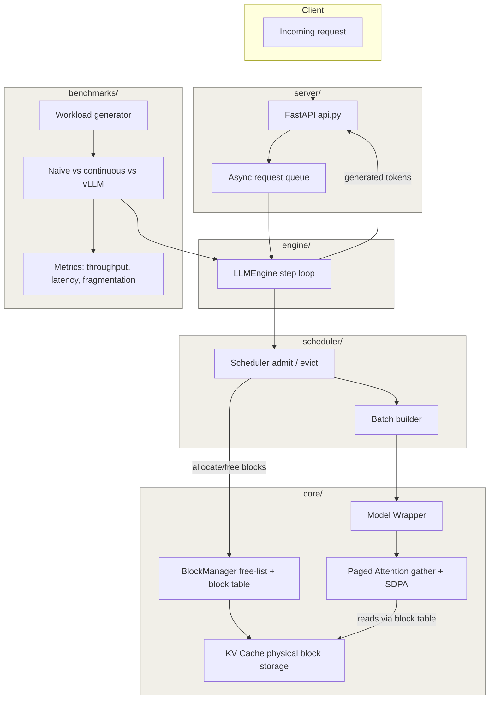

# pico-vllm — Architecture

## Flow summary

A request comes in through the server, the engine's step loop asks the
scheduler to decide which sequences run this iteration, the scheduler talks
to the block manager to allocate/free KV-cache blocks, the model wrapper
runs a forward pass using paged attention (gathering blocks from the KV
cache), and generated tokens flow back out. The benchmarks suite sits
outside this loop, driving synthetic workloads through the same engine to
produce comparison numbers against naive batching and real vLLM.
