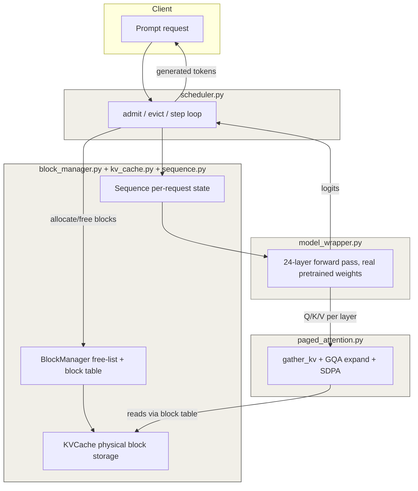

# pico-vllm

A from-scratch, single-GPU inference engine implementing PagedAttention-style
KV-cache management and continuous batching, verified against real
`Qwen2.5-0.5B-Instruct` outputs and benchmarked against a naive static
batching baseline.

## Quick start

Requirements: Python 3.11+, [uv](https://docs.astral.sh/uv/), and a PyTorch-compatible CPU or GPU. The first command below also downloads the Qwen model the first time a model-backed test, benchmark, or server request runs.

```bash
uv sync
uv run python -m pytest -q
```

## Project structure

```text
pico-vllm/
├── src/pico_vllm/
│   ├── config/             # Model/cache configuration and packaged YAML defaults
│   ├── core/               # Block manager, KV cache, sequences, paged attention
│   ├── engine/             # Model forward pass, continuous scheduler, naive baseline
│   └── server/             # FastAPI application
├── scripts/                # Reproducible benchmark programs
├── tests/                  # Component and integration correctness tests
├── docs/                   # Build notes and progress log
├── progress/               # Daily implementation notes
├── README.md
└── pyproject.toml          # Dependencies and the `pico-vllm` server command
```

All project code is imported through `pico_vllm.*`; runnable programs live in `scripts/`, keeping the repository root reserved for metadata and documentation.

## Reproduce the benchmarks

From the repository root, run:

```bash
# Naive static batching versus continuous batching
uv run python scripts/run_naive_vs_continuous.py

# Admission behavior while the KV-block pool is constrained
uv run python scripts/run_admission_under_pressure.py
```

The first benchmark prints elapsed time, real generated-token count, wasted forward-pass steps, and throughput. The second prints the request-admission timeline. Results vary with CPU/GPU, PyTorch version, model-download state, and dtype; reproduce the *comparison* rather than expecting the exact wall-clock numbers in this README.

## Run the API server

Start the local server:

```bash
uv run pico-vllm
```

### Runtime configuration

Every server setting can be supplied as either an environment variable or a CLI option:

| Environment variable | CLI option | Default | Purpose |
| --- | --- | --- | --- |
| `PICO_VLLM_MODEL_ID` | `--model-id` | `Qwen/Qwen2.5-0.5B-Instruct` | Supported Hugging Face model ID |
| `PICO_VLLM_DEVICE` | `--device` | `auto` | `auto`, `cpu`, or `cuda` |
| `PICO_VLLM_DTYPE` | `--dtype` | `float32` | `float32`, `float16`, or `bfloat16` |
| `PICO_VLLM_KV_CACHE_BLOCKS` | `--kv-cache-blocks` | `64` | Number of physical KV-cache blocks |
| `PICO_VLLM_KV_CACHE_BLOCK_SIZE` | `--kv-cache-block-size` | `16` | Tokens stored in each KV-cache block |
| `PICO_VLLM_MAX_BATCHED_TOKENS` | `--max-batched-tokens` | `512` | Per-iteration scheduler token-work budget |
| `PICO_VLLM_HOST` | `--host` | `127.0.0.1` | Server bind host |
| `PICO_VLLM_PORT` | `--port` | `8000` | Server port |

For example, start a CUDA bfloat16 server with a larger cache:

```bash
uv run pico-vllm --device cuda --dtype bfloat16 --kv-cache-blocks 256 --port 8080
```

> **Model support:** the explicit model forward pass currently supports only
> `Qwen/Qwen2.5-0.5B-Instruct`. Supplying another model ID fails at startup
> with a clear error, rather than loading incompatible weights.

It listens on `http://127.0.0.1:8000`. In another terminal, check its health and submit a request:

```bash
curl http://127.0.0.1:8000/health

curl.exe -X POST http://127.0.0.1:8000/generate -H "Content-Type: application/json" -d "{\"prompt\": \"The capital of France is\", \"max_new_tokens\": 20}"

# Stream token events until generation is complete
curl.exe -N -X POST http://127.0.0.1:8000/generate/stream -H "Content-Type: application/json" -d "{\"prompt\": \"The capital of France is\", \"max_new_tokens\": 20}"
```

The API has two routes:

| Route | Purpose |
| --- | --- |
| `GET /health` | Returns `{"status": "ok"}` when the server is running. |
| `POST /generate` | Accepts `prompt` and optional `max_new_tokens` (default: 50); returns an ID, generated text, and token count. |
| `POST /generate/stream` | Accepts the same body and emits SSE `token` events followed by a `done` event. |
| `GET /v1/models` | Lists the one loaded model in OpenAI-compatible format. |
| `POST /v1/chat/completions` | Minimal OpenAI-compatible chat endpoint supporting `messages`, `max_tokens`, and `stream`. |

The server owns one scheduler, model, block manager, and KV cache for its lifespan. Each request joins the shared waiting queue, and the background loop admits and steps active requests continuously. Use `/generate` for a completed response or `/generate/stream` to receive tokens as they are generated.

### OpenAI-compatible chat

Use the endpoint with any compatible client, or with curl:

```bash
curl.exe -X POST http://127.0.0.1:8000/v1/chat/completions -H "Content-Type: application/json" -d "{\"messages\":[{\"role\":\"user\",\"content\":\"Explain paged attention briefly.\"}],\"max_tokens\":64}"
```

Set `"stream": true` to receive standard `data: {chunk}` SSE messages, ending with `data: [DONE]`.

### Streamlit chat UI

With the API server running, open the local chat UI in another terminal:

```bash
uv run streamlit run src/pico_vllm/ui.py
```

The UI defaults to `http://127.0.0.1:8000`; change it from the sidebar if the server runs on another host or port.

Every core component — block allocation, the KV-cache, GQA-aware paged
attention, and the full multi-layer forward pass — is checked directly
against Hugging Face's own model outputs (`torch.allclose`), not just
assumed correct. The scheduler's benefit is backed by measured numbers,
not claims.

---

## Benchmark results

### 1. Naive batching vs. continuous batching (eviction efficiency)

Four prompts run together, three capped at 5 tokens and one at 50 —
deliberately mismatched lengths, since matched lengths would hide the
difference naive batching has.

| Metric                        | Naive | Continuous     |
|--------------------------------|-------|-----------------|
| Total wall-clock time (s)     | 26.31 | 9.38            |
| Real tokens generated          | 65    | 65              |
| Wasted forward-pass steps     | 135   | 0 (by design)   |
| Throughput (real tokens/sec)  | 2.47  | 6.93            |

**135 wasted forward passes** under naive batching — more wasted
computation than real computation (65 real tokens) — purely because
finished sequences keep getting stepped until the *entire* batch
finishes. Continuous batching evicts a sequence and frees its blocks the
moment it's done, giving a **2.8x throughput improvement** on identical
input, identical hardware, identical model.

### 2. Admission under memory pressure

Four requests, but the block pool only ever holds 3 blocks — not enough
for all four to start at once.

```
Admission timeline (step, seq_id):
  step   0: seq_2 admitted
  step   0: seq_0 admitted
  step   0: seq_1 admitted
  step   8: seq_3 admitted

All 4 requests completed in 4.50s, despite only 3 blocks ever being
available at once.
```

`seq_3` sat in the scheduler's waiting queue for 8 steps and was only
admitted once an earlier sequence finished and freed its block. Naive
batching has no concept of a waiting queue at all — it would fail
outright trying to allocate blocks for every sequence up front. This is
the other half of continuous batching's value: not just avoiding wasted
compute, but keeping the system moving under memory pressure that would
otherwise stall it entirely.

---

## Architecture



A request enters the scheduler, which allocates an initial block via
`BlockManager` and creates a `Sequence` to track its state. Each
generation step runs the full 24-layer forward pass through
`model_wrapper.py`, which calls `paged_attention.py` per layer —
gathering that sequence's real (non-padded) key/value data from
`KVCache` across its allocated blocks, expanding for GQA, and running
attention. The scheduler re-evaluates admission and eviction before
every single step, not just once per batch — this is what continuous
batching actually means.

A minimal FastAPI layer (`api.py`) wraps this for HTTP access.

---

## What's verified, and how

Every layer of this system is checked against real Hugging Face model
output, not just assumed correct from the math:

- **`KVCache` write/read** — verified against `past_key_values` from a
  real forward pass, including correctly sizing for this model's GQA
  setup (14 query heads, 2 KV heads) and matching its native bfloat16
  dtype.
- **`Sequence`** — unit tested in isolation: block-boundary crossing,
  the allocation-failure path, and that written data is retrievable.
- **`paged_attention`** — verified against real HF attention output
  using forward hooks on `q_proj`/`o_proj`, across a sequence long
  enough to force a multi-block gather. Caught and fixed a real bug in
  the process: the captured query was pre-RoPE while HF's cached keys
  are post-RoPE, causing a small but real mismatch — fixed by applying
  the same rotary embedding to the query before comparison.
- **Full multi-layer generation (`model_wrapper.py`)** — compared
  per-step logits against HF's own forward pass at identical input
  prefixes. In bfloat16, logits showed small, consistent numerical
  drift (~0.17-0.2 max abs diff) rather than growing/compounding error —
  diagnosed as floating-point precision, not a logic bug, and confirmed
  by rerunning in float32, where logits matched within tight tolerance.
- **Naive batching correctness** — confirmed that running multiple
  sequences sharing one `KVCache`/`BlockManager` produces byte-identical
  output to running each sequence completely alone, ruling out
  cross-sequence data corruption.

---

## Known limitations

- **No preemption.** If a *running* sequence needs a new block and the
  pool is fully exhausted (not just "this sequence needs one," but none
  exist anywhere), the current scheduler raises rather than evicting
  another running sequence or waiting gracefully. A real system would
  need a preemption policy here.
- **The server isn't truly concurrent yet.** `api.py` spins up a fresh
  `Scheduler` per HTTP request rather than running one shared scheduler
  loop that batches concurrent HTTP requests together. True concurrent
  continuous batching would need a background loop stepping one shared
  scheduler, with request handlers awaiting their own completion.
- **Attention uses gather + `scaled_dot_product_attention`, not a fused
  kernel.** Blocks are gathered into a contiguous tensor before
  attention rather than reading directly from scattered blocks inside a
  custom kernel (e.g. Triton). This was a deliberate scope decision —
  the memory management and scheduling logic were the focus, not kernel
  engineering — noted here rather than left implicit.
- **Single GPU/CPU, single model.** No tensor parallelism, no
  multi-model serving.
